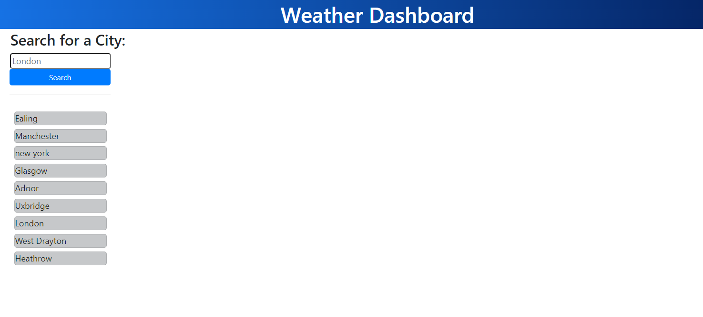
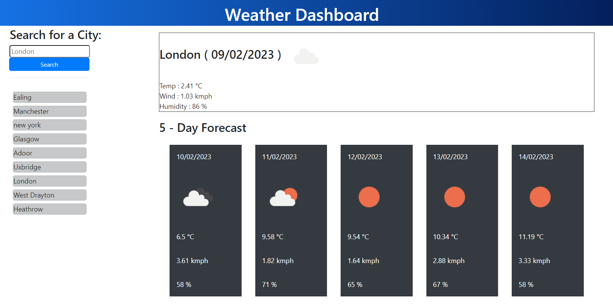

# Weather Dashboard using OpenWeatherMap API

## Description

Weather Dashborad is a web application to search weather details and 5 day's forecast for any city. 
The City name of choice can be entered in the Text Box and then click the Search button. Current weather for that city will be displayed on the right side pane. In the below pane a 5-days weather forecast is also provided.

The cities entered will be added to the history and displayed in the left side. These will be stored to the local storage and will be available when the page is accessed the next time.  Each city name in the left side pane also can be clicked to get the weather details and forecast

OpenWeatherMap API is used to get the weather details and forecast

This project demonstrates usage of third party APIs in Javascript code.

## User Story

```text
AS A traveler
I WANT to see the weather outlook for multiple cities
SO THAT I can plan a trip accordingly
```

## Screenshots


<b>The home page of Weather Dashboard</b>  
<br>  


<br>   

<br>
<b>Weather Dashboard details and forecast</b>  
<br>  


<br>   

<br>

## Credits
<b>Uma Ambikesan</b>


